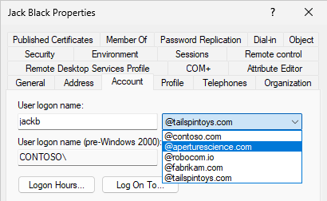
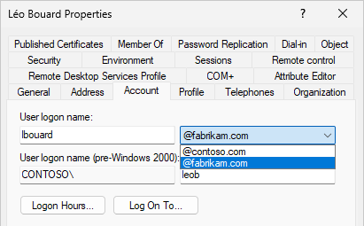
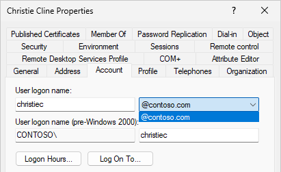
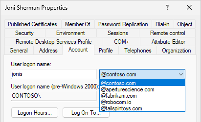

<div class="blog-header">
  <p>KCLAD (*à lire "Casser l'AD"*) est une série d'articles techniques sur des trucs idiots à faire dans un domaine Active Directory. L'idée est de torturer un peu une maquette et essayer de mieux comprendre comment fonctionne Active Directory. <b>A ne pas reproduire sur la production, évidemment !</b></p>
</div>

## La partie sans danger

### Contexte

Dans une forêt Active Directory, les UPNSuffixes représentent la liste des domaines disponibles pour l'attribut UserPrincipalName. On retrouve cette liste dans la console `dsa` "Active Directory Users and Computers" :



Cette liste permet de sélectionner simplement le domaine qui vous intéresse lors de la création ou la modification d'un utilisateur.

Problème de cette liste : **elle n'est pas triée par ordre alphabétique mais par ordre d'ajout** (du plus récent au plus ancien, avec le nom de domaine original tout en haut). Dans certaines forêts qui ont plus d'une centaine de suffixes, la sélection de la bonne option devient donc très fastidieuse.

C'est là que vient l'idée à la con : et si on triait tous les suffixes pour les remettre dans l'ordre alphabétique.

### Lister les suffixes

Comme cité précédemment, il s'agit d'un paramètre défini au niveau de la forêt. On peut donc obtenir l'information avec la commande `Get-ADForest` :

```powershell
(Get-ADForest).UPNSuffixes
```

### Ajouter un suffixe

Pour ajouter le suffixe "domain.com" à votre forêt :

```powershell
Get-ADForest | Set-ADForest -UpnSuffixes @{Add = 'domain.com'}
```

### Pour lister les suffixe utilisés

Pour lister l'utilisation et la popularité des suffixes sur l'ensemble de vos utilisateurs :

```powershell
Get-ADUser -Filter * |
    Select-Object Name, @{ N='UPNSuffix' ; E={($_.UserPrincipalName -split '@')[-1]} } |
    Group-Object UPNSuffix |
    Sort-Object Count -Descending
```

Vous devriez obtenir un résultat similaire à celui-ci :

Count | Name | Group
----- | ---- | -----
12 | contoso.com | {@{Name=Adele Vance; UPNSuffix=contoso.com}, @{Name=Alex Wilber; UPNSuffix=contoso.c...
3 |  | {@{Name=Administrator; UPNSuffix=}, @{Name=Guest; UPNSuffix=}, @{Name=krbtgt; UPNSuf...
1 | tailspintoys.com | {@{Name=Jack Black; UPNSuffix=tailspintoys.com}}
1 | fabrikam.com | {@{Name=Léo Bouard; UPNSuffix=fabrikam.com}}

### Création en dehors des suffixes

Si vous utilisez PowerShell pour créer/modifier vos utilisateurs, vous n'avez pas besoin d'ajouter un suffixe sur votre forêt. Vous pouvez directement indiquer la valeur souhaitée :

```powershell
New-ADUser -SamAccountName janed -UserPrincipalName 'janed@whateverdomain.com'
```

## La partie dangereuse

C'est décidé : on va risquer un impact sur tous les comptes utilisateurs de la forêt pour pouvoir trier une liste par ordre alphabétique !

### Suppression des suffixes

On stocke tous les suffixes dans la variable `$upnSuffixes` pour ensuite les supprimer de la forêt :

```powershell
$upnSuffixes = (Get-ADForest).UPNSuffixes
$upnSuffixes | ForEach-Object { 
    Get-ADForest | Set-ADForest -UpnSuffixes @{Remove = $_}
}
```

> Le domaine par défaut de la forêt ne peut pas être supprimé.

### Impact sur les utilisateurs

Bonne nouvelle : aucune perte d'information n'est à déclarer sur les profils utilisateurs. Aucun `UserPrincipalName` n'a été modifié et les authentifications au domaine se déroulent sans problème.

Pour les nouveaux utilisateurs et les comptes avec le suffixe par défaut liste déroulante de la console est maintenant vide (seul le domaine par défaut est disponible).





> Seul l'UPN par défaut du domaine est disponible pour les nouveaux utilisateurs. Les utilisateurs ayant un UPNSuffix différent n'ont que deux options : celui par défaut et le suffixe actuel.

### Réintégration des suffixes UPN

Il ne reste plus qu'à réintégrer les suffixes dans l'ordre alphabétique :

```powershell
$upnSuffixes | Sort-Object -Descending | ForEach-Object {
    Get-ADForest | Set-ADForest -UpnSuffixes @{Add = $_}
}
```



## Matrice de risque

